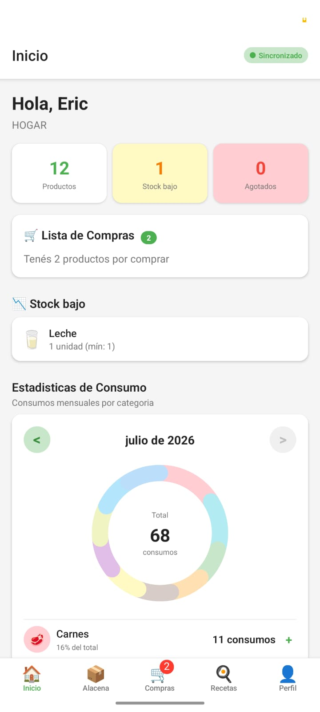
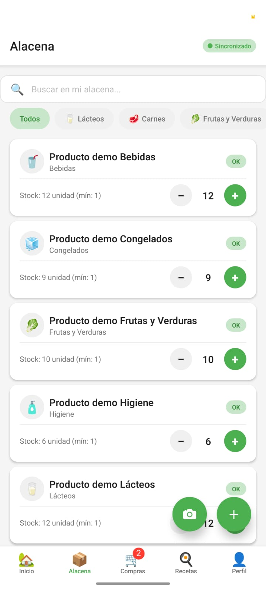
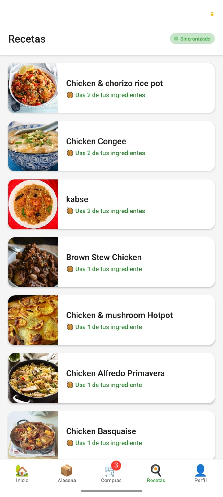
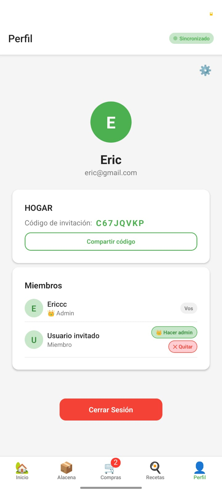

# MiAlacena

Aplicación móvil colaborativa para gestión de inventario doméstico e inteligencia de compras en tiempo real.

## Problema

Eliminar la incertidumbre sobre productos disponibles en el hogar y evitar compras duplicadas entre miembros de una vivienda.

## Propuesta de Valor

- Inventario del hogar sincronizado entre todos los miembros
- Lista de compras inteligente (automática + manual)
- Actualizaciones en tiempo real
- Reducción de compras duplicadas
- Experiencia colaborativa y simple

---

## Características principales

- Gestión colaborativa de múltiples hogares.
- Inventario compartido sincronizado en tiempo real.
- Gestión de categorías y productos.
- Lista de compras automática basada en stock mínimo.
- Lista de compras manual.
- Escaneo de códigos de barras (EAN/UPC) utilizando Open Food Facts.
- Estadísticas de consumo mensuales.
- Recomendación inteligente de recetas utilizando TheMealDB.
- Administración de perfil y configuración de la casa.
- Invitación de miembros mediante código único.
- Arquitectura desacoplada utilizando servicios y Zustand.
- Base de datos PostgreSQL administrada mediante Supabase.

---

## Capturas de pantalla

> Agregar imágenes en `docs/screenshots/`.

| Inicio | Inventario |
|--------------|--------------|
|  |  |

| Recetas | Perfil |
|--------------|--------------|
| |  |

---

## Instalación

### Requisitos

- Node.js 20 LTS
- npm 10+
- Expo SDK 54
- Android Studio o Expo Go
- Cuenta de Supabase

### 1. Clonar el proyecto

```bash
git clone https://github.com/usuario/MiAlacena.git
cd MiAlacena
```

### 2. Instalar dependencias

```bash
npm install
```

### 3. Configurar Supabase

Crear un proyecto en Supabase y ejecutar los siguientes scripts SQL en el SQL Editor:

```
supabase_schema.sql
supabase_seed.sql (opcional)
supabase_seed_consumption_events.sql (opcional)
```

### 4. Variables de entorno

Crear el archivo `.env`:

```env
EXPO_PUBLIC_SUPABASE_URL=https://xxxxxxxx.supabase.co
EXPO_PUBLIC_SUPABASE_KEY=tu-anon-key
```

### 5. Ejecutar la aplicación

```bash
npx expo start
```

o

```bash
npx expo start --android
```

```bash
npx expo start --ios
```

```bash
npx expo start --web
```

---

## Tecnologías utilizadas

- React Native
- Expo
- TypeScript
- Supabase
- PostgreSQL
- Zustand
- React Navigation
- React Native SVG
- Expo Camera
- Open Food Facts API
- TheMealDB API

### Versiones Mínimas
- **Android**: API 23 (Android 6.0)
- **iOS**: 13.0

---

## Arquitectura

```
MiAlacena/
src
 ├ components
 │ ├ barcode
 │ │ └ ScanCameraButton.tsx
 │ ├ home
 │ │ └ ConsumptionStatsSection.tsx
 │ ├ inventory
 │ │ ├ CategoryFilter.tsx
 │ │ └ ProductCard.tsx
 │ ├ shopping
 │ │ └ ShoppingItemCard.tsx
 │ └ ui
 │ │ ├ Button.tsx
 │ │ ├ Card.tsx
 │ │ ├ EmptyState.tsx
 │ │ ├ index.ts
 │ │ ├ Input.tsx
 │ │ ├ PressableScale.tsx
 │ │ ├ QuantityStepper.tsx
 │ │ ├ SearchBar.tsx
 │ │ ├ StatusBadge.tsx
 │ │ └ SyncStatusBadge.tsx
 ├ config
 │ ├ constants.ts
 │ └ supabase.ts
 ├ data
 ├ hooks
 │ └ useSyncEngine.ts
 ├ lib
 │ ├ storage.ts
 │ ├ syncEngine.ts
 │ └ uuid.ts
 ├ navigation
 │ ├ MainTabs.tsx
 │ └ RootNavigator.tsx
 ├ screens
 │ ├ auth
 │ │ ├ LoginScreen.tsx
 │ │ └ RegisterScreen.tsx
 │ ├ home
 │ │ ├ HomeScreen.tsx
 │ │ └ HouseSetupScreen.tsx
 │ ├ inventory
 │ │ ├ AddProductScreen.tsx
 │ │ ├ BarcodeScannerScreen.tsx
 │ │ ├ EditProductScreen.tsx
 │ │ ├ InventoryScreen.tsx
 │ │ └ ProductDetailScreen.tsx
 │ ├ profile
 │ │ └ ProfileScreen.tsx
 │ ├ recipes
 │ │ ├ RecipeDetailScreen.tsx
 │ │ └ RecipesScreen.tsx
 │ ├ settings
 │ │ └ SettingsScreen.tsx
 │ └ shopping
 │ │ └ ShoppingScreen.tsx
 ├ services
 │ ├ auth.service.ts
 │ ├ barcode.service.ts
 │ ├ category.service.ts
 │ ├ consumptionBuffer.service.ts
 │ ├ consumptionStats.service.ts
 │ ├ house.service.ts
 │ ├ product.service.ts
 │ ├ recipe.service.ts
 │ ├ shopping.service.ts
 │ └ shoppingSync.service.ts
 ├ stores
 │ ├ auth.store.ts
 │ ├ consumptionStats.store.ts
 │ ├ house.store.ts
 │ ├ product.store.ts
 │ ├ shopping.store.ts
 │ └ sync.store.ts
 ├ theme
 │ └ index.ts
 ├ types
 │ └ index.ts
 └ utils
 │ └ validation.ts

├── utils/                  # Utilidades compartidas (cliente Supabase, helpers)
│   └── supabase.ts
├── docs/                   # Documentación extendida
├── supabase_schema.sql     # Schema SQL para inicializar la base de datos
├── .env                    # Variables de entorno (no commitear)
└── ...
```

### Justificación Arquitectónica

- **Feature-based structure**: Cada feature tiene sus propias pantallas, componentes y lógica. Facilita la escalabilidad.
- **Services layer**: Abstrae la comunicación con Supabase. Si se migra a otro backend, solo se modifica esta capa.
- **Stores separados**: Cada dominio (auth, house, product, shopping) tiene su propio store. Evita un estado monolítico.
- **UI components**: Design system propio para mantener consistencia visual.

---

## Modelo de Datos

### Entidades

| Entidad | Descripción |
|---|---|
| **House** | Representa un hogar compartido. Contiene el nombre de la casa y un código de invitación único para permitir que nuevos usuarios se unan al grupo. |
| **UserProfile** | Almacena la información pública de cada usuario, incluyendo nombre, correo electrónico y avatar. Está vinculado a la autenticación de Supabase. |
| **HouseMember** | Tabla de relación entre usuarios y hogares. Define qué usuarios pertenecen a cada casa y el rol que poseen (`admin` o `member`). |
| **Category** | Categorías utilizadas para organizar los productos del inventario (Lácteos, Carnes, Verduras, Limpieza, etc.). Cada categoría pertenece a una casa y mantiene un orden de visualización. |
| **Product** | Representa un producto del inventario. Almacena nombre, categoría, cantidad disponible, unidad de medida, stock mínimo, estado (OK, Bajo o Agotado) y la información necesaria para su gestión. |
| **ShoppingItem** | Elemento de la lista de compras. Puede crearse manualmente por un usuario o automáticamente cuando un producto alcanza el stock mínimo definido. |
| **ConsumptionEvent** | Registra cada consumo confirmado de un producto del inventario. Almacena la casa, producto, categoría, cantidad consumida, fecha del evento y el mes y año de referencia para generar estadísticas de consumo. |
| **PushToken** | Almacena los tokens de notificaciones push de cada dispositivo móvil asociados a un usuario, permitiendo el envío de notificaciones mediante Expo Push Notifications. |

### Reglas de Negocio

- `cantidad_actual <= 0` → Estado: **Agotado** (rojo)
- `cantidad_actual <= stock_minimo` → Estado: **Bajo** (naranja)
- `cantidad_actual > stock_minimo` → Estado: **OK** (verde)
- Productos con stock bajo pueden agregarse automáticamente a la lista de compras

---

## Seguridad

- **Row Level Security (RLS)**: Cada tabla tiene políticas que restringen acceso solo a miembros de la casa.
- **Autenticación**: Email/password con Supabase Auth. Tokens JWT con refresh automático.
- **Persistencia segura**: Sesión almacenada en AsyncStorage con token refresh.

---

## Solución de Problemas

### Error: "AsyncStorageError: Native module is null"
Las dependencias fueron pineadas para evitarlo. Si aparece, asegurate de haber ejecutado `npm install` limpio:

```bash
rm -rf node_modules package-lock.json && npm install
```

---

## Documentación Extendida

- [Historias de Usuario](docs/user-stories.md)
- [Roadmap / Entregas](docs/roadmap.md)
- [Design System](docs/design-system.md)
- [Changelog](docs/CHANGELOG.md)

---

## Créditos

Proyecto desarrollado como trabajo académico para la asignatura **Desarrollo de Aplicaciones Moviles** de la **Universidad Tecnológica Nacional - Facultad Regional La Plata (UTN-FRLP)**.

### Integrantes

- Manrique Agustín
- Noval Leandro 
- Siadore Valentino 
- Trebino Figueroa Eric

### APIs utilizadas

- Open Food Facts
- TheMealDB

### Librerías principales

- React Native
- Expo
- Supabase
- Zustand
- React Navigation
- React Native SVG

---

## Trabajo futuro

- Notificaciones Push.
- Predicción inteligente de consumo.
- Dashboard avanzado.
- Exportación de estadísticas.
- Integración con supermercados.
- Modo offline completo.

---

## Licencia

Proyecto desarrollado con fines académicos.

Todos los derechos reservados.
